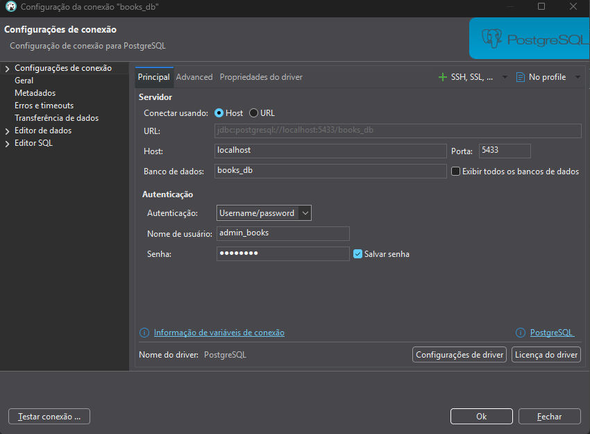

# Guia sobre como utilizar dbeaver

## Por que utilizar
Esse será o ambiente padrão onde vamos testar e visualizar o banco de dados.

## Instalação
A instalação pode ser feita no [site oficial](https://dbeaver.io/)
Obs: Tem que ser a verão Community

## Setup
Para a configuração correta coloque os parâmetros conforme a imagem abaixo:

A senha é "**password**"

