# Elicitação de Requisitos

Para a etapa de elicitação de requisitos, optamos por utilizar as técnicas de Benchmarking e Brainstorming.

## Benchmarking

Para a etapa de benchmarking, cada membro da equipe ficou responsável por testar e analisar uma plataforma específica. Em seguida, reunimos os resultados para debater os pontos fortes e fracos de cada uma. 
Decidimos diversificar o escopo de aplicações a serem analisadas, porque julgamos que as iguais a nossa proposta eram insuficiente. Analisamos as seguintes aplicações:
* **Escambook e Troca de Livros:** Plataformas mais alinhadas ao nosso objetivo principal de troca. Contudo, a análise indicou que ambas apresentam limitações para operar em grande escala.
* **Estante Virtual:** Embora seja voltada para a venda de livros usados, foi selecionada por apresentar um fluxo inicial de usuário e jornada de busca muito semelhantes aos que pretendemos implementar no nosso projeto.
* **OLX:** Mesmo não sendo uma plataforma focada exclusivamente em livros ou trocas, queríamos analisar a negociação via chat e a descoberta de itens de interesse entre os usuários.
* **Skoob:** Analisada por compartilhar exatamente o mesmo público-alvo que o nosso, oferecendo referências de interface para busca, catalogação e exibição de livros.

---

### Troca de livros
O Troca de Livros é uma aplicação que conecta leitores para a troca colaborativa de livros já lidos, funcionando por meio de um sistema de cadastro (login), listagem de obras disponíveis (com descrição e até três fotos), busca por títulos desejados e solicitação de troca entre usuários. O funcionamento é regido por um sistema de pontos: quem envia um livro ganha 1 ponto, enquanto quem recebe tem 1 ponto descontado, permitindo que o ciclo de trocas se mantenha ativo continuamente, com o envio recomendado via Correios.

#### Login
Tem opção de entrar com facebook ou google, além da opção tradicional com email e senha.
![[Descrição da Imagem]]([assets/troca%20de%20livros/login-troca-de-livros.png])

#### Cadastro
![[Descrição da Imagem]]([[assets/troca%20de%20livros/cadastro-troca-de-livros.png])

#### Exibição
A página principal do site tem 3 carrosséis principais.

#### Possíveis estados de um livro
Aqui, basicamente, temos 3 estados para um livro: lido, lendo e quero ler. Ao clicar em quero ler, ele nos dá a opção de quero trocar. Lido ou lendo não acionam essa opção, mantendo o padrão de “Tenho esse livro” como opção.

#### Ações possíveis na página do livro
Nessa página temos as seguintes opções: trocar o livro, sinalizar que já possui o livro e a opção de comprar por um link na Amazon.

#### Informações na página do livro
Podemos acessar o título, a capa, o resumo, a quantidade de páginas, o ano e o autor. O usuário também pode adicionar um comentário ao livro. 

Também é possível adicionar um comentário em um livro.

#### Trocando um livro
A primeira página que é exibida ao clicar em “Trocar livro” é composta por todos os livros disponíveis para troca. Temos o nome da pessoa, a cidade em que ela mora, seu último acesso e a chance dessa pessoa responder. 
Em cada card existem dois botões: um para abrir um chat com a pessoa e outro para fazer a troca. 

#### Chat
Esse é o card que é exibido ao clicar no botão para abrir o chat com alguma pessoa.

#### Página de troca
Na página de troca são exibidas informações sobre a pessoa que é dona do livro. Ele exibe quantas solicitações essa pessoa já recebeu, aceitou, rejeitou e enviou. Além disso, ele também exibe a média das avaliações que essa pessoa recebeu de pessoas que trocaram livros com ela. Também é exibido nessa mesma tela um extrato mostrando quantos pontos você possui, quanto o livro “custa” e seu balanço após a troca.

Nessa mesma tela é possível sinalizar como vai ser a entrega. Se o usuário selecionar que já combinou com a outra parte e vai receber pessoalmente, pode enviar a solicitação direto. Caso contrário, ele deve fornecer um endereço, como está abaixo:

A ideia é a pessoa que está com o livro enviar pelos correios e pagar a taxa. 

#### Sistema de pontos
Os pontos do site podem ser ganhos ao trocar um livro ou comprados por meio do sistema abaixo. Ele fornece preços diferentes dependendo do seu nível no site, o qual é determinado por meio do número de trocas que você já fez.

#### Adicionando um livro que já existe no site
Essa tela é exibida quando o usuário clica num livro que ele colocou como lido 

##### Adicionando um livro novo ao site

#### Ranking
Aqui temos um ranking das pessoas que mais trocam livros no mês corrente.

#### Busca
Nos permite buscar livros pelo nome, autor e tag. Os resultados na página abaixo são dinâmicos, conforme a digitação. 

Ao pressionar “Enter”, ele direciona para a tela onde são exibidos todos os resultados.

#### FAQ
O site possui uma seção de dúvidas frequentes.

#### Como funciona
Página dedicada a explicar como funciona o site. Inclui um vídeo também.

#### Pontos positivos
* **Sistema de economia:** O sistema de pontos é inteligente por criar um ciclo contínuo: ganhar 1 ponto ao enviar e perder 1 ao receber força a circulação do acervo. Além disso, atrelar o preço da compra de pontos ao "nível" do usuário (baseado no volume de trocas).
* **Métricas de Confiança e Transparência:** A plataforma tenta mitigar a insegurança das trocas online ao expor publicamente a "chance de resposta" do usuário , seu último acesso , a média de avaliações de trocas anteriores e um histórico claro de solicitações (recebidas, aceitas, rejeitadas e enviadas).
* **Flexibilidade Logística:** Oferecer a opção de entrega em mãos (quando as partes combinam previamente), além do envio pelos Correios, reduz barreiras para usuários da mesma cidade.
* **Vias de Monetização Claras:** Além da venda direta de pontos (TrocaBank) , o redirecionamento para compra de livros novos via link da Amazon na página do título é uma boa forma de gerar receita passiva.
* **UX Focada na Comunicação:** A inclusão de um botão de chat diretamente no card de listagem das estantes agiliza o contato sem exigir navegação excessiva.
* **Busca Otimizada:** A barra de pesquisa com resultados dinâmicos (que aparecem durante a digitação) melhora muito a fluidez na hora de procurar um título específico.
* **Ranking:** O ranqueamento mensal dos usuários que mais trocam livros pode ser visto como uma boa estratégia de engajamento. 

#### Pontos negativos
* **Desempenho Crítico:** A lentidão extrema relatada no carregamento das páginas é um gargalo gravíssimo.
* **Lógica de Estados de Leitura Contraintuitiva:** O fluxo em que apenas a opção "Quero ler" aciona o "Quero trocar" , enquanto marcar como "Lido" ou "Lendo" apenas mantém o status "Tenho esse livro", parece confuso. O comportamento natural de um usuário seria querer disponibilizar para troca exatamente os livros que ele já concluiu (marcou como "Lido").
* **Atrito no Cadastro de Acervo:** O formulário de cadastro de livros exige o preenchimento manual de muitos metadados (ISBN 10 e 13, editora, páginas, ano). Sem uma integração com APIs externas (como Google Books ou Open Library) para preencher isso automaticamente pelo título.

---

### EscamBook
Isso aqui não é um site funcional. Consegui entrar com um email, nome e número de telefone inventados. Além disso consigo acessar a URL de partes privadas do site e não muito dificilmente conseguiria extrair dados sensiveis de usários. Possivelmente é um AI Slop.
Entretanto, vale analisar se o site possui algumas ideias boas.

#### Adicionar livro

#### Adicionar novo livro

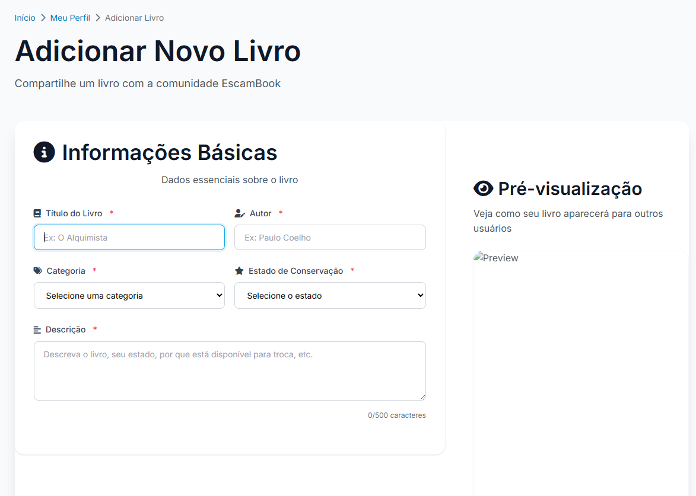

#### Feed

#### Post

#### Busca

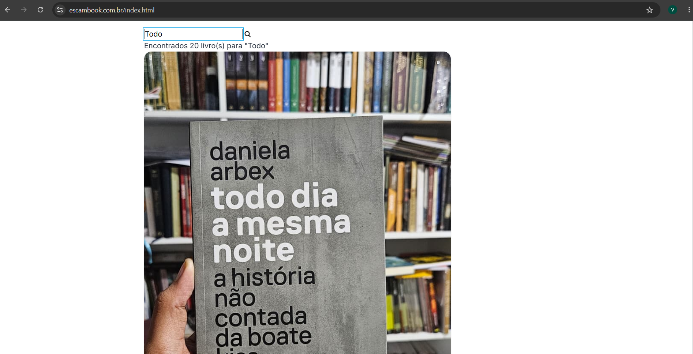

#### Como funciona

#### Pontos positivos
* Permite adicionar e procurar livros para trocar.
* Mostra estado e imagem do livro.
* Site é direto ao ponto.
* Troca direta entre usuários.
* Tem um sistema de preferências sobre trocas, mas que não consegui acessar em nenhum
dos livros.

#### Pontos negativos
* A troca e conversa e feita a partir do número de telefone pessoal(whatsapp), expondo
dados sensiveis.
* O site é feito com IA sem o mínimo de protocolos de segurança.
* Não possue um sistema de review/reputação dos usuários.
* O único filtro de pesquisa existe é entre 7 generos de leitura.
* Sistema de busca de livros é rudimentar, com péssima UI/UX e rígido em relação a
ortografia.

---

### Estante Virtual

#### Cadastro
O cadastro pede cpf, data de aniversário, número de celular e preenche automaticamente os dados de nome e sobrenome. O número de celular é usado para fazer uma verificação do cadastro. Gostamos do campo de apelido pois como o sistema puxa o nome automaticamente, dá a opção do usuário escolher um nome que prefira, gerando maior respeito e identificação.

![[Cadastro Estante Virtual]](assets/estante%20virtual/cadastro-estante.png)

#### Favoritos

A aba de favoritos possui 3 opções de lista: minhas listas, comprar mais tarde e minhas listas antigas. O usuário ainda pode criar uma nova lista e preencher campo de nome, descricao e seleção de privacidade, caso selecione como lista pública, a mesma pode ser usada para recomendação no feed. As listas podem ser editadas, deletadas ou compartilhadas e sua visualização na tela é dada com nome da lista, cadeado de privacidade e quantidade de livros que ela contém.

![[Favoritos Estante Virtual]](assets/estante%20virtual/favoritos-estante.png)

#### Feed
O feed possui carroseis com diferentes tópicos: o que os outros clientes estão comprando, livros mais vendidos, clássicos, universos literários, editoras, entre outros. Isso é muito legal para que o usuário conheça novos livros sem ser os que ele está buscando. O feed também possui alguns filtros de frete grátis, ofertas entre outros.

![[Feed Estante Virtual]](assets/estante%20virtual/feed-estante.png)

#### Filtro e Busca
O filtro possui alguns campos: Autor e Título, título, autor, editorae e isbn. A pesquisa funciona muito bem, mesmo tendo colocado um nome bem errado na procura de um livro, ele achou o livro que estava procurando. A única ressalva é que a pesquisa precisa estar de acordo com o filtro (e não há um default), entao se eu estiver em um filtro de editora, nao ira aparecer nada se um buscar pelo título de um livro - o usuário tem que ficar sempre atento a isso, oque pode não ser bem visto.

![[Filtro e busca Estante Virtual]](assets/estante%20virtual/filtro-busca-estante.png)

#### Post
O post no feed contem foto, título, nome do autor, ano de publicação, menor oferta e botão que vai para a tela em que mostra tods as ofertas daquela edição. Ao clicar nesse botão, vemos novas informações além das citadas, como por exemplo sinopse, avaliação do vendedor, compartilhamento, e as ofertas. As ofertas posseum filtro de localização e ordenação por preço, facilitando o usuário entender qual oferta mais o agrada. Gostamos da opção de compartilhamento, pois permite ao usuário compartilhar algo que ele gostou ou que sabe que outros vão gostar.
Ao selecionar uma oferta também é possível colocar na lista de comprar mais tarde, ver detalhes e falar com o vendedor
A página de ver detalhes informa mais sobre o estado de conservação do livro, além das informações de edição (e o botão de comprar)
Não chegamos a falar com o vendedor, mas a tela é um campo em que voce digita o texto (que não pode ter alguns caracters).

![[Post Estante Virtual]](assets/estante%20virtual/post-estante.png)

#### Página vendedor
Não conseguimos acessar pois não possuímos cnpj

![[Página do vendedor Estante Virtual]](assets/estante%20virtual/vendedor-estante.png)

#### Pontos positivos
* Várias sessões no feed que permite o usuário descobrir novos livros
* Bem organizado e as informações são evidentes
* Sistema de busca funciona bem
* Compartilhento de anúncio
* Busca por cep e isbn

#### Pontos negativos
* Verificação de usuário parece um pouco demais, assusta um pouco ver seu nome preenchido automaticamente
* Apenas pessoas com cnpj podem vender seus livros
* Muitos tipos de listas

---

### OLX

#### Busca
A busca no aplicativo permite a inclusão de diferentes filtros de pesquisa, como preço, reputação do anunciante (se aplicável), categoria (e a depender da categoria novos filtros são aplicáveis). Além disso, é possível definir uma localização para buscar resultados próximos, algo que julgamos importante pela logística da troca. Os resultados podem ainda ser ordenados por preço, data de postagem e relevância. É possível também salvar uma busca para consulta posterior.

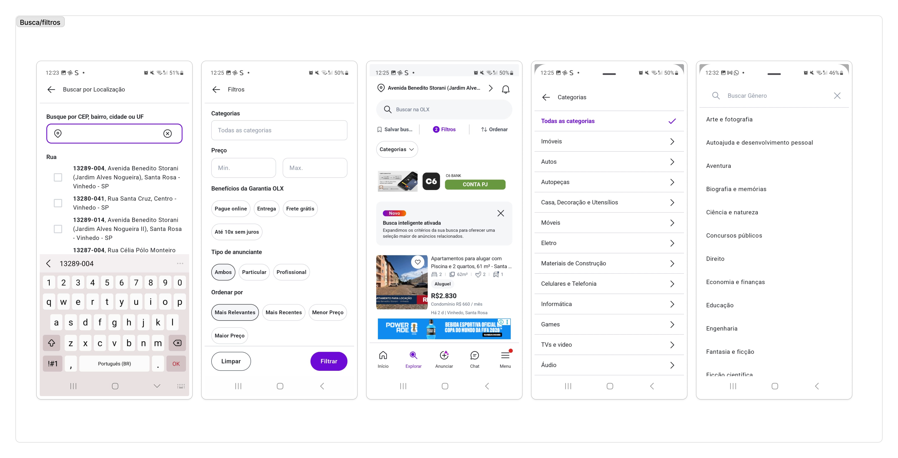

#### Chat
Ao iniciar uma nova conversa, o chat exibe as principais informações do vendedor para que o usuário possa avaliar a credibilidade e segurança da venda. É possível também olhar as informações mais importantes do anúncio na parte superior (título e preço), para que o usuário se contextualize mais facilmente. Algumas opções de mensagens rápidas são exibidas, para facilitar o primeiro contato e a negociação.
Na aba de chats, as conversas podem ser separadas pelo status de comprador ou vendedor, e é possível buscar por chats específicos. Ao entrar pela primeira vez na aba de chat, o aplicativo exibe instruções de segurança, assim como no momento em que você inicia uma nova conversa com um vendedor.

#### Criar post
A criação de uma nova publicação é feita de maneira sequencial. Ao definir a categoria principal a qual seu anúncio pertence, o app te direciona para caminhos diferentes que requisitam dados diferentes. Focamos em analisar o processo para o anúncio de um livro. O aplicativo pede as informações de genêro, estado de conservação, formato (capa dura, de bolso ou capa normal), além das informações padrão de título do anúncio, localidade, fotos, informações adicionais e preço.

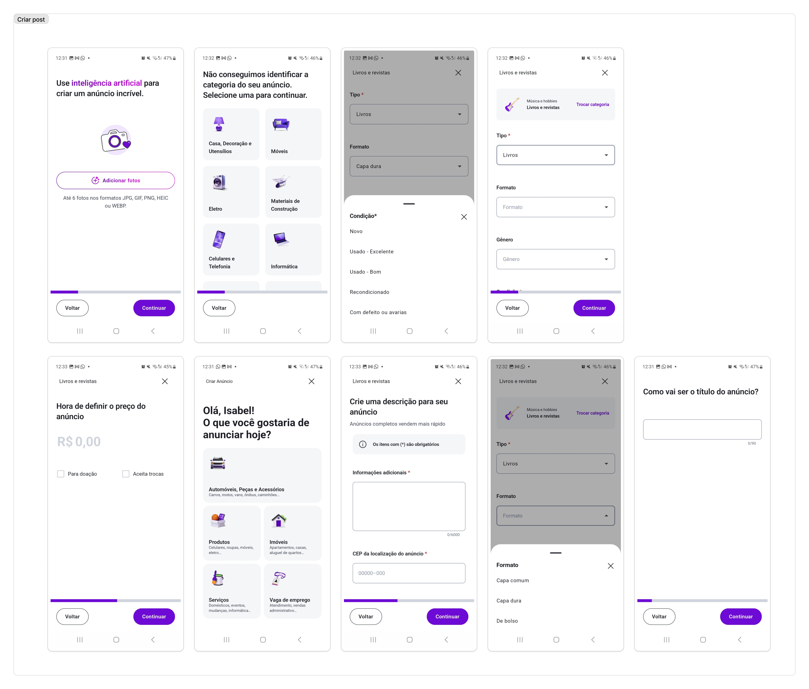

#### Feed
O feed é segmentado em diferentes carrosseis, variando de acordo com o algoritmo. Os post são buscados com base na localização definida (pode usar a localização atual ou definir manualmente). É possível escolher categorias específicas para se ver no feed, desde categorias mais gerais como imóveis, a mais específicas como imóveis para venda.

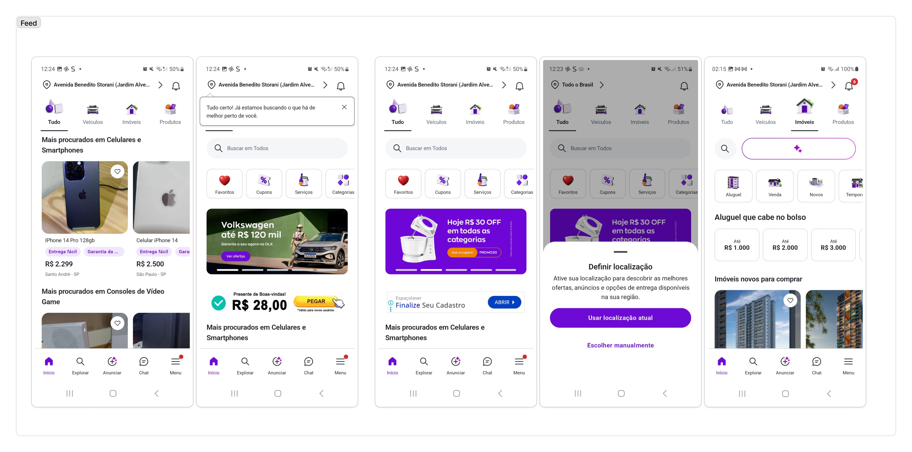

#### Perfil 
O perfil varia entre o perfil tradicional e o profissional. O perfil padrão é bem simples exibindo as informações de nome, foto, data de início no app, número de posts e histórico de postagens, de maneira bem simples, mostrando apenas o essencial.
Perfis profissionais são mais trabalhados, mostrando mais estátiscas de venda, avaliação pelos usuários, trazendo maior credibilidade.
O acesso ao próprio perfil se dá pelo menu, em um botão pequeno na parte de cima, meio escondido.  

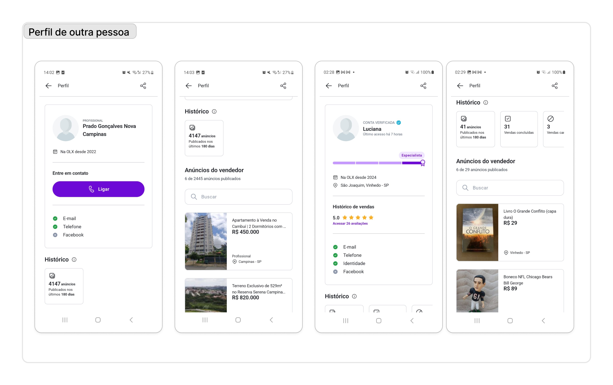
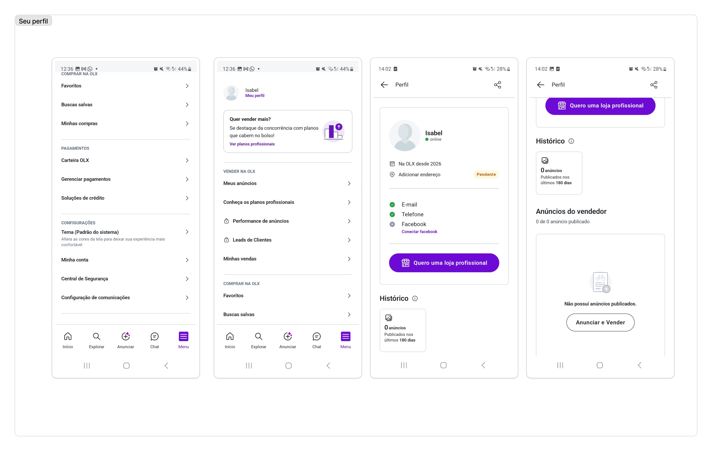

#### Publicação
Em uma publicação, é possível ver as fotos do anúncio, título, preço, descrição, anunciante (podendo clicar e se redirecionar ao perfil), detalhes, localização e dicas de segurança.  
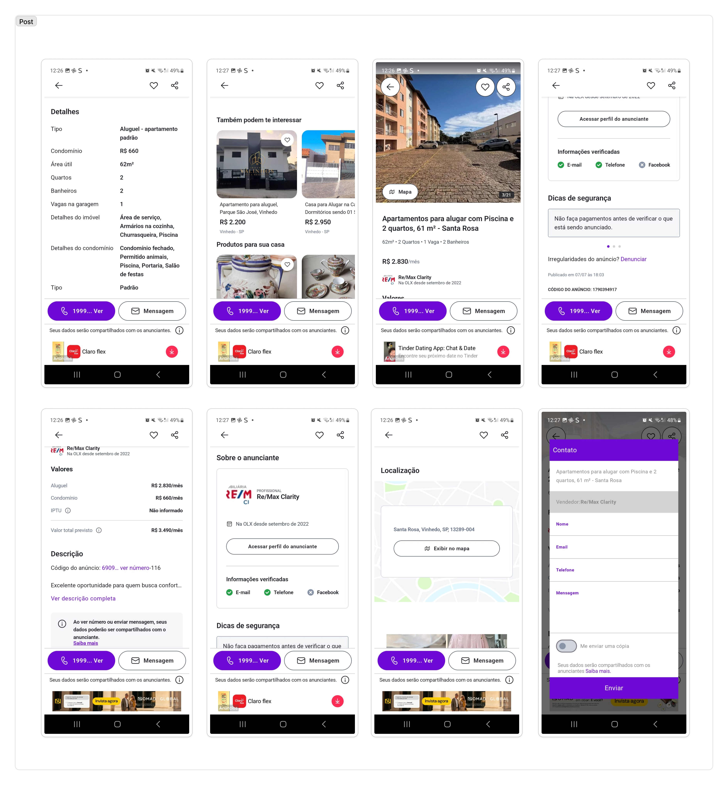

#### Pontos positivos
* Feed filtrado pela localização 
* Ver estatísticas do usuário, porque traz credibilidade.
* Chat separado de posts que você publicou e posts que você teve interesse

#### Pontos negativos
* A avaliação ser uma funcionalidade exclusiva para perfis profissionais (com planos pagos). A funcionalidade agrega confiabilidade e segurança, mas por ficar restrita a perfis pagos quase não foi vista na exploração das publicações.

---

### Skoob
No Skoob avaliamos a aba do perfil do usuário/autor, as opções de acessibilidade e página de descrição de um livro cadastrado.

#### Perfil 
No Skoob o perfil pessoal possui três setores interessantes: contador de seguidores/seguindo e livros sendo lidos (em amarelo), configurações/acessibilidade (em verde) e barra de conteúdos. 
O contador de seguidores (em amarelo) é interessante pois pode criar uma cultura de trocadores comuns, i.e, trocadores de um bairro ou região específica se seguindo (se você segue um outro usuário, você é notificado quando ele publica). Quanto ao contador de livros na biblioteca, pode ter um contador de trocas realizadas ou livros disponíveis para troca. A clicar no botão de configuração (em verde), abre-se a seguinte tela onde é possível configurar o perfil (info, bio e foto), e acessar a mesma configuração de tamanho de fonte, disponível na tela do perfil.
A barra de conteúdos (em vermelho) possui 5 abas, sendo elas: Feed, Citações, Resenhas, Vídeos e Histórico de leitura. Não vejo essa aba fazendo sentido em um "Market" place. Assim, talvez o layout pode servir de inspiração, mas as abas podem ser substituídas (e.g, Livros para troca, Livros de interesse). Para fins de comparação, é assim que o perfil de um terceiro aparece:

![[Perfil Skoob]](assets/skoob/Perfil_Page-skoob.jpg)

#### Perfil de Autor
A estrutura é parecida com a de leitor, mas possui um contador de Leitores (no lugar de seguindo) e informações sobre sua escrita, com um sobre, Gênero, links externos e livros publicados. É interessante, pois abre a possibilidade de pesquisa por autor e cria uma comunidade em volta de um escritor.

![[Perfil de autor Skoob]](assets/skoob/autor_1Page-skoob.jpeg)
![[Perfil de autor Skoob]](assets/skoob/autor_2Page-skoob.jpeg)

#### Acessibilidade
##### Tamanho do texto
A tela de tamanho de texto é a página com um dos ui/ux mais legais do app, nela o usuário configura o tamanho da fonte com um preview iterativo de uma interface do app. O design é intuitivo e facilita o uso para quem precisa da acessibilidade.

![[Ajuste tamanho de texto Skoob]](assets/skoob/fonte_1-skoob.jpeg)
![[Ajuste tamanho de texto Skoob]](assets/skoob/fonte_2-skoob.jpeg)

##### Temas
O app possui tema escuro e claro, oque facilita a utilização dele em ambientes claros e escuros.
![[Escolha de tema Skoob]](assets/skoob/temas-skoob.jpeg)

#### Descrição do livro
A tela de um livro possui a Sinopse (em vermelho), as informações de identificação (editora, nº páginas, ISBN, etc.) em (em amarelo). Além disso, tem a seção de Leitores (em azul), com as informações do livro no site (e.g, Leram, Lendo, Quer ler, Relendo, Abandonados). Por fim, a seção de avaliações que é atualizada conforme a resenha dos usuários.

Essa tela é interessante para acumular informações de uma obra específica, pode ajudar no
sistemas de busca por livro.

![[Descrição livro Skoob]](assets/skoob/descricao_1-skoob.jpg)
![[Descrição livro Skoob]](assets/skoob/descricao_2-skoob.jpg)

#### Sistema de busca
O sistema de pesquisa pode ser feito por texto (em vermelho) ou código de barra do livro (em verde). Além disso, tem como pesquisar por filtro de editoras (em cinza) e separar a pesquisa por Livros, Leitores, Autores (em amarelo).

![[Busca livro Skoob]](assets/skoob/busca-skoob.jpg)

#### Pontos positivos
* 
* 

#### Pontos negativos
* 
* 

---

### Funcionalidades de Interesse
* 
* 
* 

## Brainstorm
O processo de brainstorming ocorreu em duas etapas: primeiro, fizemos uma dinâmica livre de 10 minutos para que todos pudessem expor suas ideias. Em seguida, organizamos os resultados por similaridade, o que nos ajudou a agrupar e definir os temas principais.

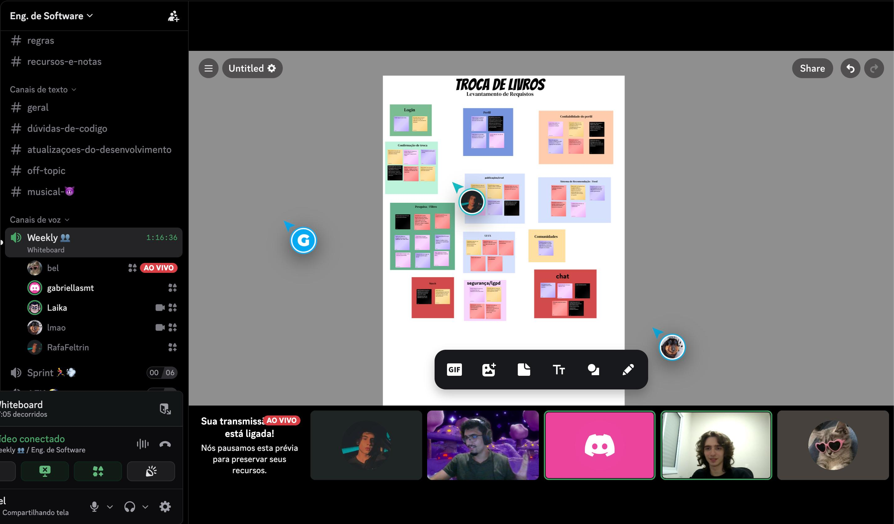
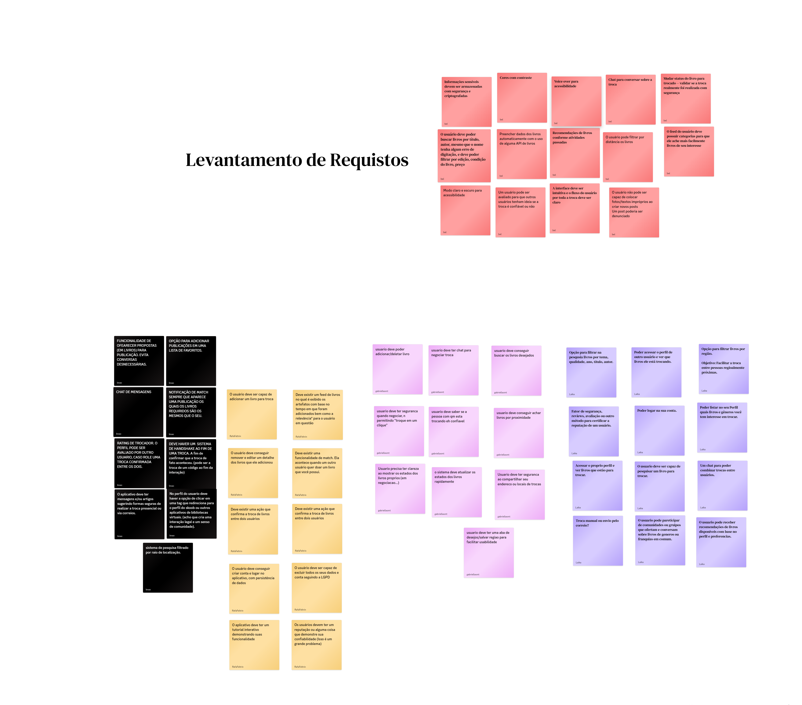
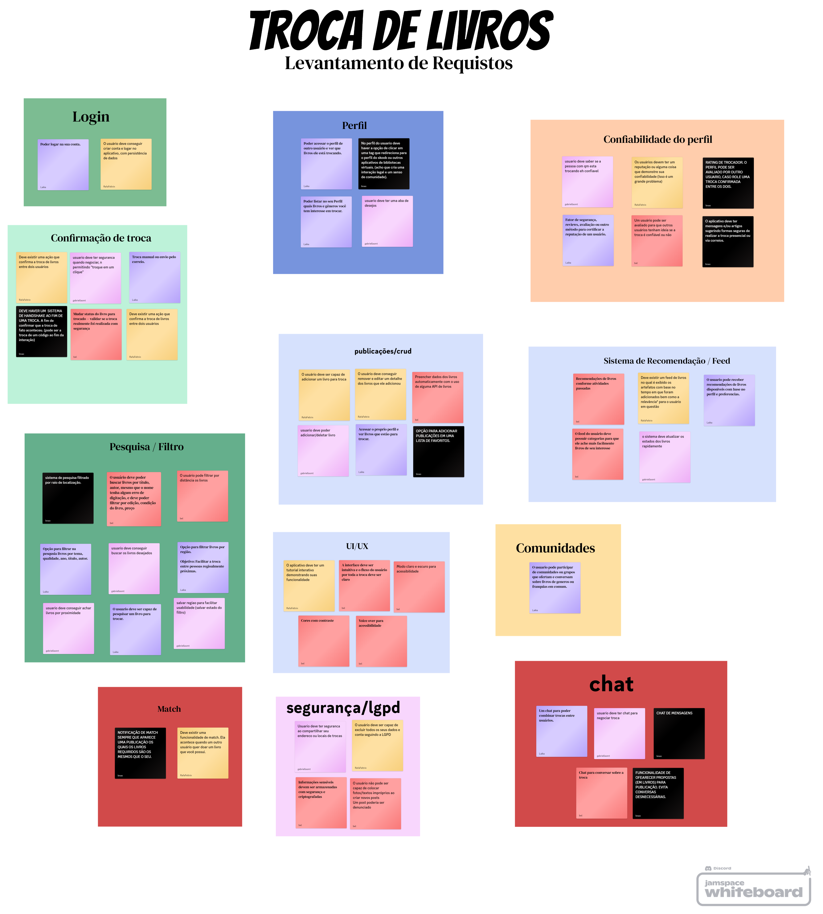

## Arquitetura C4
.png)

